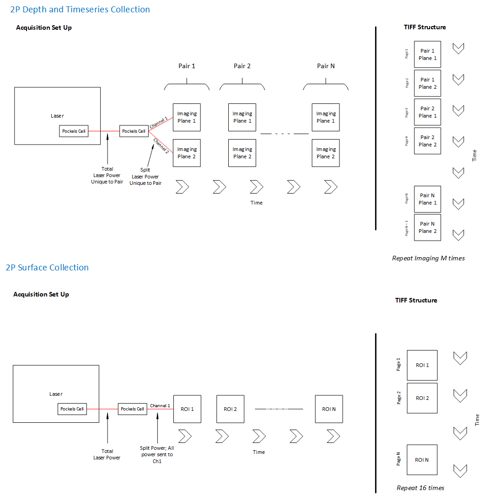

# Standards on planar optical physiology acquisition
Version: 0.0.1

## Acquisition/Raw Data Format

Planar optical physiology data should be saved to a directory called pophys. Files should be in raw TIFF format (v4) with optional, related images (surface, depth, local and cortical stacks) and application metadata in the same directory. 

**Single Plane**

Trials are 2-photon movies captured as a series of TIFF files with a maximum size of 2000 frames per TIFF.

Three experimental epochs are collected during a session. Each can contain a variety of trials. Experimental epochs are called: Spontaneous, Single Neuron BCI Conditioning and 2p Photostimulation.

A local TIFF stack is acquired above and below (40um) the ROI for motion correction and for locating the FOV on successive days.

.mat files saved for each Single Neuron BCI Conditioning trial and contains threshold parameters for BCI mapping.

Scan Image outputs a file detecting the frame shift of the FOV to motion correct ROI (.csv).

Scan Image saves the power of laser used in 2p photostimulation (.stim file); analog voltage signal sampled at 9kHz.

Full activity traces for the duration of the BCI experiment of ROI of the conditioned neurons and ~30 other neurons considered as candidates for the conditioned neuron (.csv).

```plaintext
📦pophys
 ┣ 📜spont_000n.tiff
 ┣ 📜neuron_000n.tiff
 ┣ 📜photostim_000n.tiff
 ┣ 📜local.tiff
 ┣ 📜neuron.mat
 ┣ 📜correction.csv
 ┣ 📜activity.csv
 ┣ 📜photostim_power.stim
```

**Multiplane**

Epi-fluorescence surface vasuculature image is acquired for session-to-session matching and saved in TIFF format.

2-photon surface image stored as a TIFF for each ROI where the image contains interleaved images of the 2p ROI surface acquired in one channel. Each ROI will be on it's TIFF page. 16 frames per ROI (See Figure 1).

2-photon depth image are stored TIFF for each plane. Images are acquired in 2 channels and each plane will be on it's own page in the TIFF stack where the orders are P1, C1, P1, C2 (See Figure 1). There are 16 frames per plane (2x longer than the surface image)

There is one movie file for a stimulus presented during a session. The timeseries image is acquired as a TIFF in the same order as the depth image (See Figure 1). The frame rate of acquisition will vary based on how many paired planes are being imaged.

Local z-stacks are in TIFF formats and are acquired by pairs. The number of z-stacks equals the number of paired planes. The contents are interleaved and acquired in both channels (P1, C1, P1, C2).

Cortical stack for each ROI and they are acquired in one channel. 

A fullfield TIFF file is used for registration of the ROI, surface 2p files for visual reistration. The fullfield scans the entire FOV. 

ROI files are stored with all images acquired by Scan Image and contain cordinates for each ROI and scanfield for each non-stack TIFF files (surface, depth, timeseries and fullfield). The ROI files are loaded by users for day-to-day targeting to help operators know the location of each ROI.

```plaintext
📦pophys
 ┣ 📜mouse-id_YYYY-MM-DD_HH-MM-SS_averaged_depth.tiff
 ┣ 📜mouse-id_YYYY-MM-DD_HH-MM-SS_averaged_surface.tiff
 ┣ 📜mouse-id_YYYY-MM-DD_HH-MM-SS_fullfield.roi
 ┣ 📜mouse-id_YYYY-MM-DD_HH-MM-SS_fullfield.tiff
 ┣ 📜mouse-id_YYYY-MM-DD_HH-MM-SS_local_z_stack0.tiff
 ┣ 📜mouse-id_YYYY-MM-DD_HH-MM-SS_surface.roi
 ┣ 📜mouse-id_YYYY-MM-DD_HH-MM-SS_timeseries.roi
 ┣ 📜mouse-id_YYYY-MM-DD_HH-MM-SS_timeseries.tiff
 ┗ 📜mouse-id_YYYY-MM-DD_HH-MM-SS_vasculature.tif
```



*Figure 1*


### Application notes

ScanImage major version >= 2020

### Relationship to aind-data-schema Session

Power configurations and frame rate(s) are stored in the session.json under the ophys_fovs key within data_streams. Laser configuration and frame rates are recorded for each FOV. In the case of multiplane acquisition, associated pairs are linked under the coupled_fov_index and ROI FOV is recorded under scanimage_roi_index. The index field is used to count how many FOVs were acquired in a single session.

## Primary Data Format

Raw movie files are converted to HDF5 files. HDF5 files contain movie from one plane only. Within the HDF5 file, the movie is stored as the *data* dataset and metadata from the TIFF header are stored as the *metadata* dataset.

The conversion from TIFF to HDF5 happens before upload to cloud. Multiplane data must be de-interleaved into separate planes and saved as HDF5 while single-plane images must be stitched together from the array of TIFFs collected on the rig.

Single plane HDF5s with multiple stimulus epochs are annotated using the datasets tiff_stem_location and epoch_location. tiff_stem_location contains the frames associated with each TIFF stem name in the data dataset while the epoch_location records the frames in the dataset associated with each epoch (spontaneous activity, single neuron BCI activity and 2p photostimulation). Single plane HDF5s also contain one TIFF header for each unique, TIFF stem type.

To specify a reference image for processing a "reference_image.h5" file must be specified as a virtual, HDF5 dataset in the same directory as the primary data format.

**Single Plane File Structure**

```plaintext
📦pophys
 ┣ 📜mouse-id_YYYY-MM-DD_HH-MM-SS.h5
 ┣ 📜mouse-id_YYYY-MM-DD_HH-MM-SS_VDS.h5
 ┣ 📜mouse-id_YYYY-MM-DD_HH-MM-SS_reference_image.h5
 ┣ 📜mouse-id_YYYY-MM-DD_HH-MM-SS_local-stack.h5
 ┣ 📜mouse-id_YYYY-MM-DD_HH-MM-SS_neuron.mat
 ┣ 📜mouse-id_YYYY-MM-DD_HH-MM-SS_correction.csv
 ┣ 📜mouse-id_YYYY-MM-DD_HH-MM-SS_activity.csv
 ┣ 📜mouse-id_YYYY-MM-DD_HH-MM-SS_photostim_power.stim
```

**Multiplane File Structure**

```plaintext
📦pophys
 ┣ 📂VISP0_1
 ┃ ┣ 📜mouse-id_YYYY-MM-DD_HH-MM-SS.h5
 ┃ ┣ 📜mouse-id_YYYY-MM-DD_HH-MM-SS_averaged_depth.h5
 ┃ ┣ 📜mouse-id_YYYY-MM-DD_HH-MM-SS_averaged_surface.h5
 ┃ ┗ 📜mouse-id_YYYY-MM-DD_HH-MM-SS_local-stack.h5
 ┣ 📂VISP0_2
 ┃ ┣ 📜mouse-id_YYYY-MM-DD_HH-MM-SS.h5
 ┃ ┣ 📜mouse-id_YYYY-MM-DD_HH-MM-SS_averaged_depth.h5
 ┃ ┣ 📜mouse-id_YYYY-MM-DD_HH-MM-SS_averaged_surface.h5
 ┃ ┗ 📜mouse-id_YYYY-MM-DD_HH-MM-SS_local-stack.h5
 ┣ 📂VISP0_3
 ┃ ┣ 📜mouse-id_YYYY-MM-DD_HH-MM-SS.h5
 ┃ ┣ 📜mouse-id_YYYY-MM-DD_HH-MM-SS_averaged_depth.h5
 ┃ ┣ 📜mouse-id_YYYY-MM-DD_HH-MM-SS_averaged_surface.h5
 ┃ ┗ 📜mouse-id_YYYY-MM-DD_HH-MM-SS_local-stack.h5
 ┣ 📂VISP0_4
 ┃ ┣ 📜mouse-id_YYYY-MM-DD_HH-MM-SS.h5
 ┃ ┣ 📜mouse-id_YYYY-MM-DD_HH-MM-SS_averaged_depth.h5
 ┃ ┣ 📜mouse-id_YYYY-MM-DD_HH-MM-SS_averaged_surface.h5
 ┃ ┗ 📜mouse-id_YYYY-MM-DD_HH-MM-SS_local-stack.h5
 ┗ 📜mouse-id_YYYY-MM-DD_HH-MM-SS_cortical-stack1.h5
```

### Application notes

[aind-ophys-mesoscope-image-splitter](https://github.com/AllenNeuralDynamics/aind-ophys-mesoscope-image-splitterc)

[aind-ophys-bergamo-stitcher](https://github.com/AllenNeuralDynamics/aind-ophys-bergamo-stitcher)


## File Quality Assurance

The number of frames in each HDF5 file should match the number of frames in the TIFF files.

The acquisition start time and end time should be consistent with the frames acquired at a given frame rate.


## Vocabulary

**Single Plane**

FOV: Field of view of the imaging region.
ROI: Region of interest pertaining to conditioned cell.

**Multiplane**

FOV: Field of view of the entire brain.
ROI: Region of interest pertaining to the plane being imaged.
